# Hello World!
This section explains how the software installed so far can be used to compile a code for the microcontroller.

## Windows/Linux
- Create a folder with any name you like on the desktop.
- Open that folder. Follow the images below to open it in VSCode.
    ````{tab-set}
    ```{tab-item} 1
    
    ```
    ```{tab-item} 2
    
    ```
    ```{tab-item} 3
    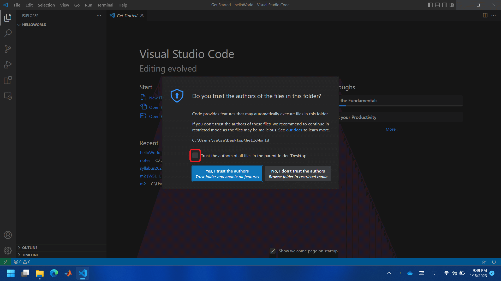
    ```
    ```{tab-item} 4
    
    ```
    ````
- Reopen the folder in WSL. Thus, you'll have access to the Ubuntu linux terminal from VSCode. Note that once you reopen folder in VSCode with WSL, you'll see `WSL:Ubuntu` written in the bottom left green colored area.
    ````{tab-set}
    ```{tab-item} 1
    
    ```
    ```{tab-item} 2
    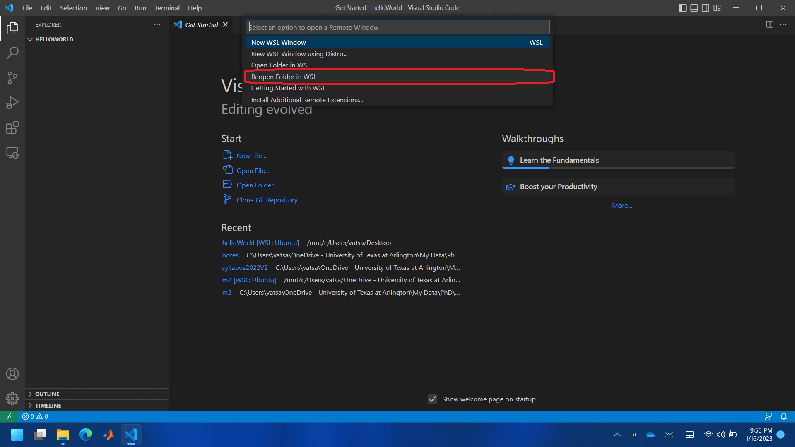
    ```
    ```{tab-item} 3
    
    ```
    ````

## MacOS
- Create a folder with any name you like on the desktop.
- Follow the images below to open it in VSCode. The name for the folder in my case is `blink`. Note that the bottom accent color of VSCode changes from purple to blue.
    ````{tab-set}
    ```{tab-item} 1
    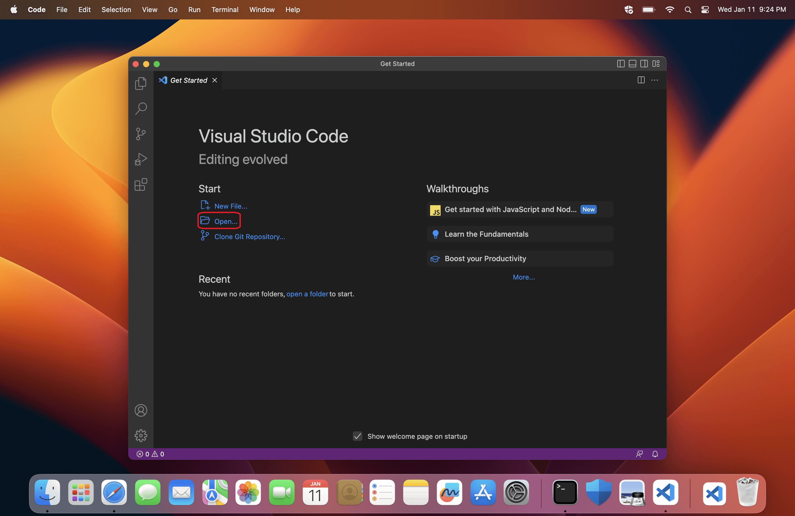
    ```
    ```{tab-item} 2
    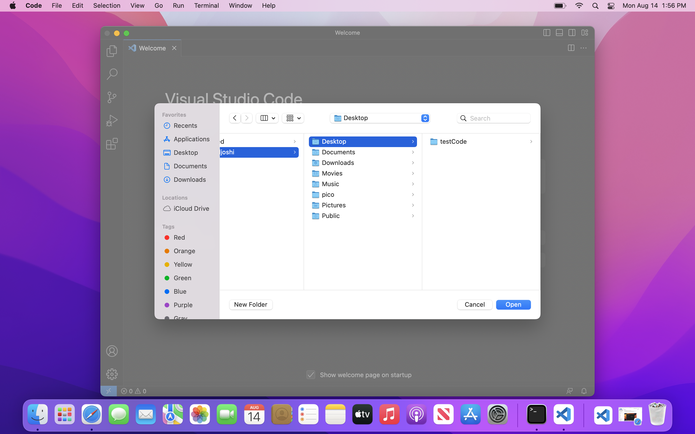
    ```
    ```{tab-item} 3
    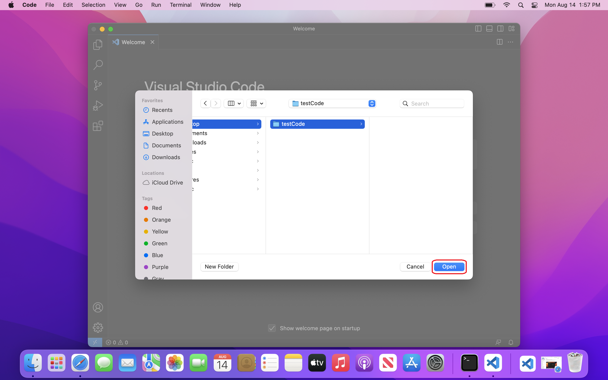
    ```
    ```{tab-item} 4
    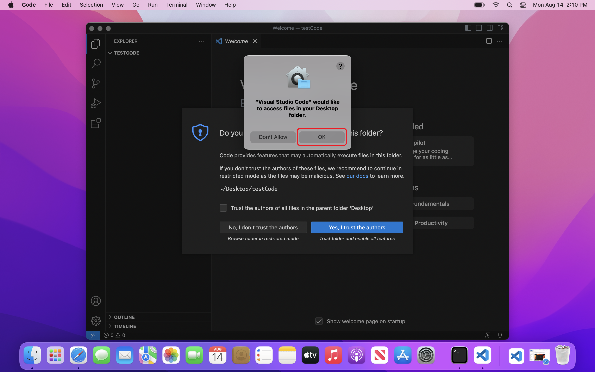
    ```
    ```{tab-item} 5
    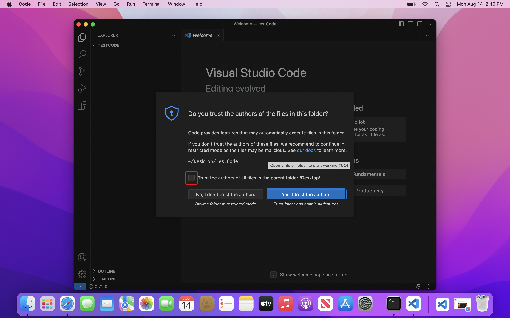
    ```
    ```{tab-item} 6
    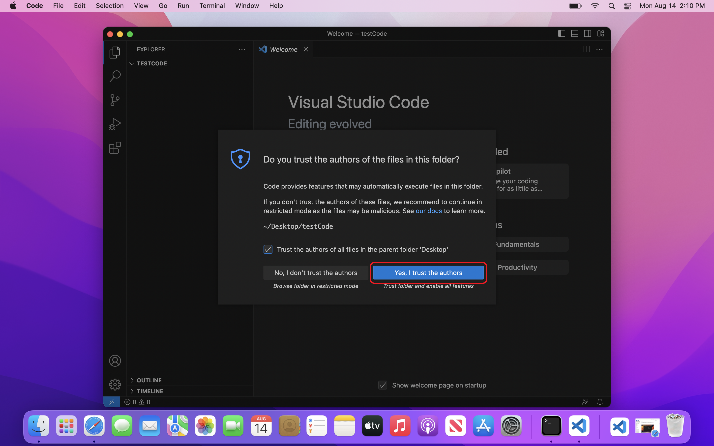
    ```
    ```{tab-item} 7
    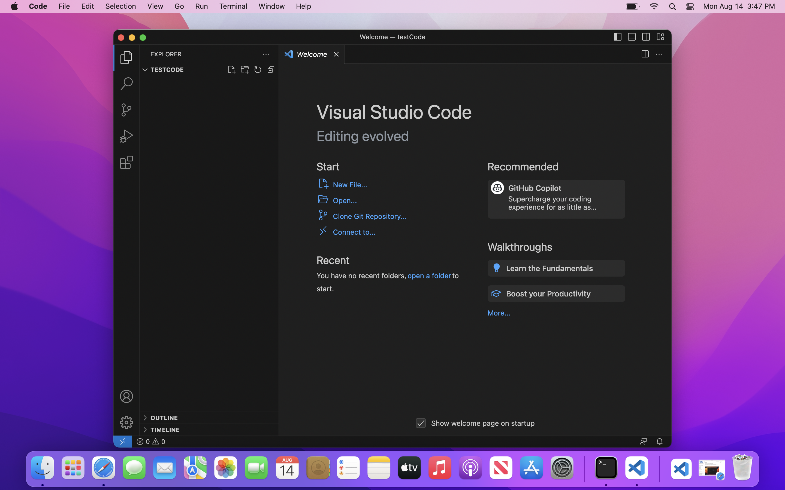
    ```
    ````

The steps are independent of the operating system from here on.
- Create three files with names `helloWorld.cpp`, `pico_sdk_import.cmake` and `CMakeLists.txt`. Make sure to create `CMakeLists.txt` with correct case, i.e. capital or small. Follwoing images show steps to create a file through VSCode.
    ````{tab-set}
    ```{tab-item} 1
    
    ```
    ```{tab-item} 2
    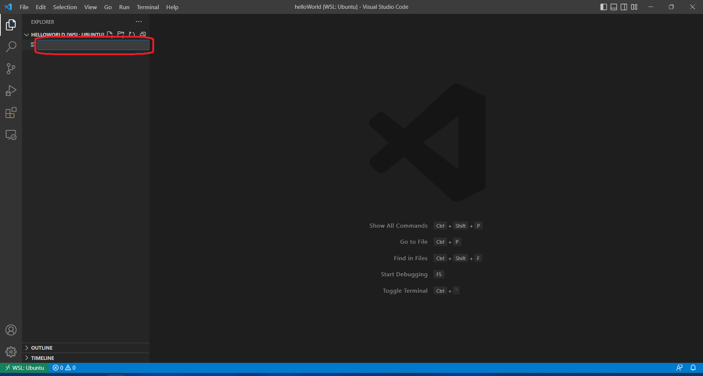
    ```
    ```{tab-item} 3
    
    ```
    ````
- Copy following in `helloWorld.cpp` file and save it. You can use <kbd>⌃&#160;Control</kbd> + <kbd>S</kbd> (Windows) or <kbd>⌘&#160;Command</kbd> + <kbd>S</kbd> (MacOS) to save a file.
    ```c++
    #include <stdio.h>
    #include <pico/stdlib.h>

    #define LED_PIN 25

    bool pinState = true;

    int main()
    {
        stdio_init_all();

        gpio_init(LED_PIN);
        gpio_set_dir(LED_PIN, true);
        gpio_put(LED_PIN, pinState);

        while (true)
        {
            pinState = !pinState;
            gpio_put(LED_PIN, pinState);
            printf("Hello World!\r\n");
            sleep_ms(1000);
        }
    }
    ```
- Copy following in `pico_sdk_import.cmake` file and save it.
    ```cmake
    # This is a copy of <PICO_SDK_PATH>/external/pico_sdk_import.cmake

    # This can be dropped into an external project to help locate this SDK
    # It should be include()ed prior to project()

    if (DEFINED ENV{PICO_SDK_PATH} AND (NOT PICO_SDK_PATH))
        set(PICO_SDK_PATH $ENV{PICO_SDK_PATH})
        message("Using PICO_SDK_PATH from environment ('${PICO_SDK_PATH}')")
    endif ()

    if (DEFINED ENV{PICO_SDK_FETCH_FROM_GIT} AND (NOT PICO_SDK_FETCH_FROM_GIT))
        set(PICO_SDK_FETCH_FROM_GIT $ENV{PICO_SDK_FETCH_FROM_GIT})
        message("Using PICO_SDK_FETCH_FROM_GIT from environment ('${PICO_SDK_FETCH_FROM_GIT}')")
    endif ()

    if (DEFINED ENV{PICO_SDK_FETCH_FROM_GIT_PATH} AND (NOT PICO_SDK_FETCH_FROM_GIT_PATH))
        set(PICO_SDK_FETCH_FROM_GIT_PATH $ENV{PICO_SDK_FETCH_FROM_GIT_PATH})
        message("Using PICO_SDK_FETCH_FROM_GIT_PATH from environment ('${PICO_SDK_FETCH_FROM_GIT_PATH}')")
    endif ()

    set(PICO_SDK_PATH "${PICO_SDK_PATH}" CACHE PATH "Path to the Raspberry Pi Pico SDK")
    set(PICO_SDK_FETCH_FROM_GIT "${PICO_SDK_FETCH_FROM_GIT}" CACHE BOOL "Set to ON to fetch copy of SDK from git if not otherwise locatable")
    set(PICO_SDK_FETCH_FROM_GIT_PATH "${PICO_SDK_FETCH_FROM_GIT_PATH}" CACHE FILEPATH "location to download SDK")

    if (NOT PICO_SDK_PATH)
        if (PICO_SDK_FETCH_FROM_GIT)
            include(FetchContent)
            set(FETCHCONTENT_BASE_DIR_SAVE ${FETCHCONTENT_BASE_DIR})
            if (PICO_SDK_FETCH_FROM_GIT_PATH)
                get_filename_component(FETCHCONTENT_BASE_DIR "${PICO_SDK_FETCH_FROM_GIT_PATH}" REALPATH BASE_DIR "${CMAKE_SOURCE_DIR}")
            endif ()
            # GIT_SUBMODULES_RECURSE was added in 3.17
            if (${CMAKE_VERSION} VERSION_GREATER_EQUAL "3.17.0")
                FetchContent_Declare(
                        pico_sdk
                        GIT_REPOSITORY https://github.com/raspberrypi/pico-sdk
                        GIT_TAG master
                        GIT_SUBMODULES_RECURSE FALSE
                )
            else ()
                FetchContent_Declare(
                        pico_sdk
                        GIT_REPOSITORY https://github.com/raspberrypi/pico-sdk
                        GIT_TAG master
                )
            endif ()

            if (NOT pico_sdk)
                message("Downloading Raspberry Pi Pico SDK")
                FetchContent_Populate(pico_sdk)
                set(PICO_SDK_PATH ${pico_sdk_SOURCE_DIR})
            endif ()
            set(FETCHCONTENT_BASE_DIR ${FETCHCONTENT_BASE_DIR_SAVE})
        else ()
            message(FATAL_ERROR
                    "SDK location was not specified. Please set PICO_SDK_PATH or set PICO_SDK_FETCH_FROM_GIT to on to fetch from git."
                    )
        endif ()
    endif ()

    get_filename_component(PICO_SDK_PATH "${PICO_SDK_PATH}" REALPATH BASE_DIR "${CMAKE_BINARY_DIR}")
    if (NOT EXISTS ${PICO_SDK_PATH})
        message(FATAL_ERROR "Directory '${PICO_SDK_PATH}' not found")
    endif ()

    set(PICO_SDK_INIT_CMAKE_FILE ${PICO_SDK_PATH}/pico_sdk_init.cmake)
    if (NOT EXISTS ${PICO_SDK_INIT_CMAKE_FILE})
        message(FATAL_ERROR "Directory '${PICO_SDK_PATH}' does not appear to contain the Raspberry Pi Pico SDK")
    endif ()

    set(PICO_SDK_PATH ${PICO_SDK_PATH} CACHE PATH "Path to the Raspberry Pi Pico SDK" FORCE)

    include(${PICO_SDK_INIT_CMAKE_FILE})
    ```
- Copy following in `CMakeLists.txt` file and save it.
    ```cmake
    cmake_minimum_required(VERSION 3.13)
    set(ENV{PICO_SDK_PATH} "~/pico/pico-sdk/")
    include(pico_sdk_import.cmake)
    project(helloWorld C CXX ASM)

    set(CMAKE_C_STANDARD 11)
    set(CMAKE_CXX_STANDARD 17)
    pico_sdk_init()

    add_executable(helloWorld
    helloWorld.cpp
    )
    pico_add_extra_outputs(helloWorld)

    pico_enable_stdio_usb(helloWorld 1)
    target_link_libraries(helloWorld pico_stdlib)
    ```
- Press <kbd>⌃&#160;Control</kbd> + <kbd>⇧&#160;Shift</kbd> + <kbd>P</kbd> (Windows) or <kbd>⌘&#160;Command</kbd> + <kbd>⇧&#160;Shift</kbd> + <kbd>P</kbd> (MacOS), and follow the steps shown in the images below. Note that a `build` folder is created. This folder will contain a `*.uf2` file when the C++ code is compiled properly.
    ````{tab-set}
    ```{tab-item} 1
    
    ```
    ```{tab-item} 2
    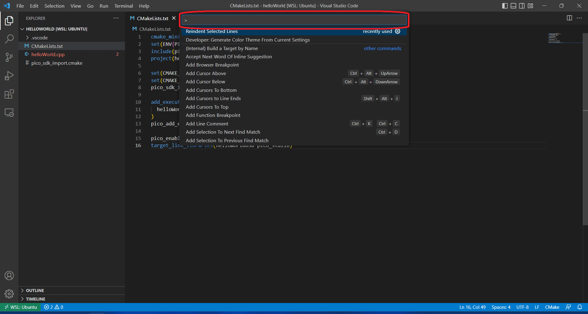
    ```
    ```{tab-item} 3
    
    ```
    ```{tab-item} 4
    
    ```
    ```{tab-item} 5
    
    ```
    ```{tab-item} 6
    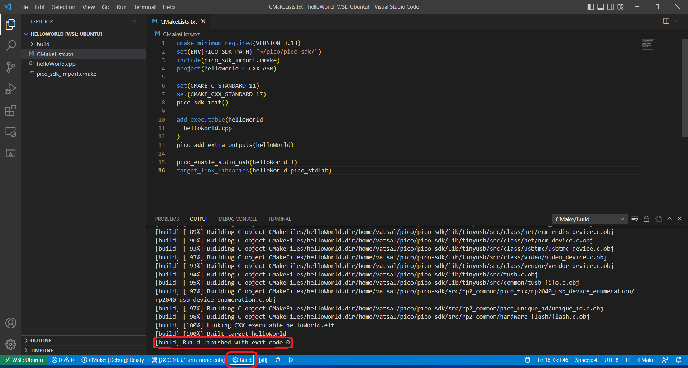
    ```
    ```{tab-item} 7
    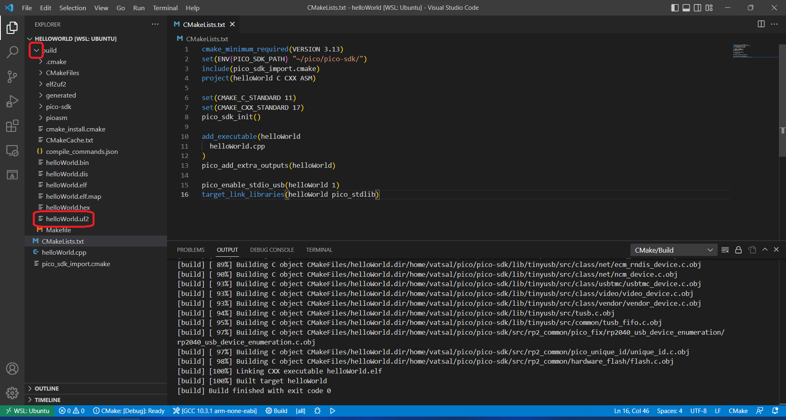
    ```
    ````